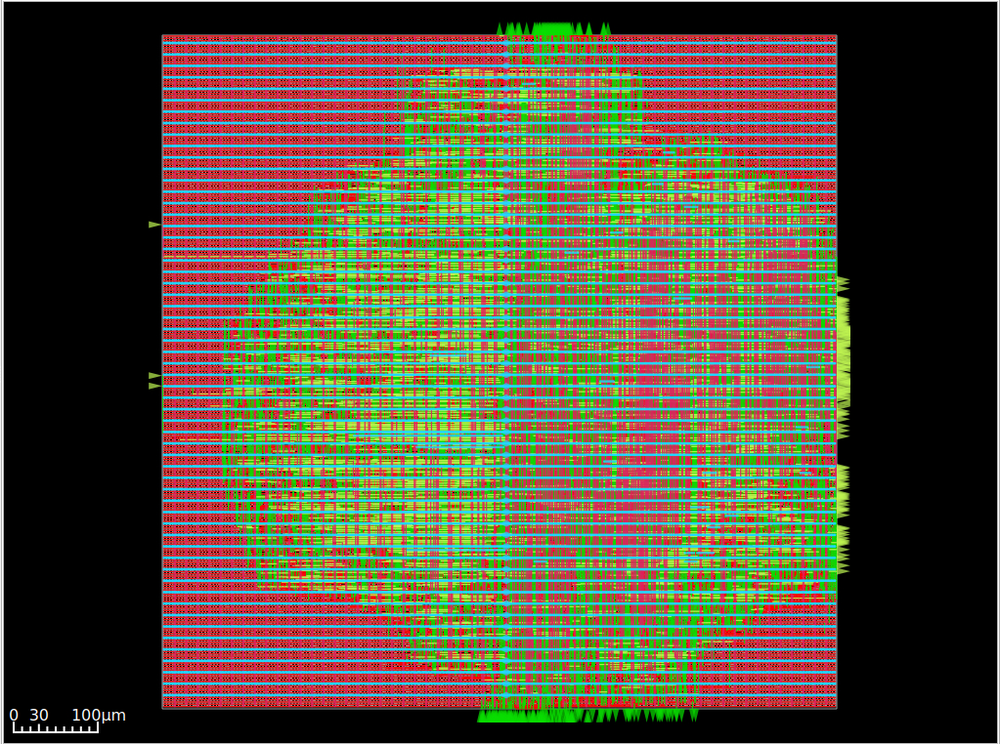
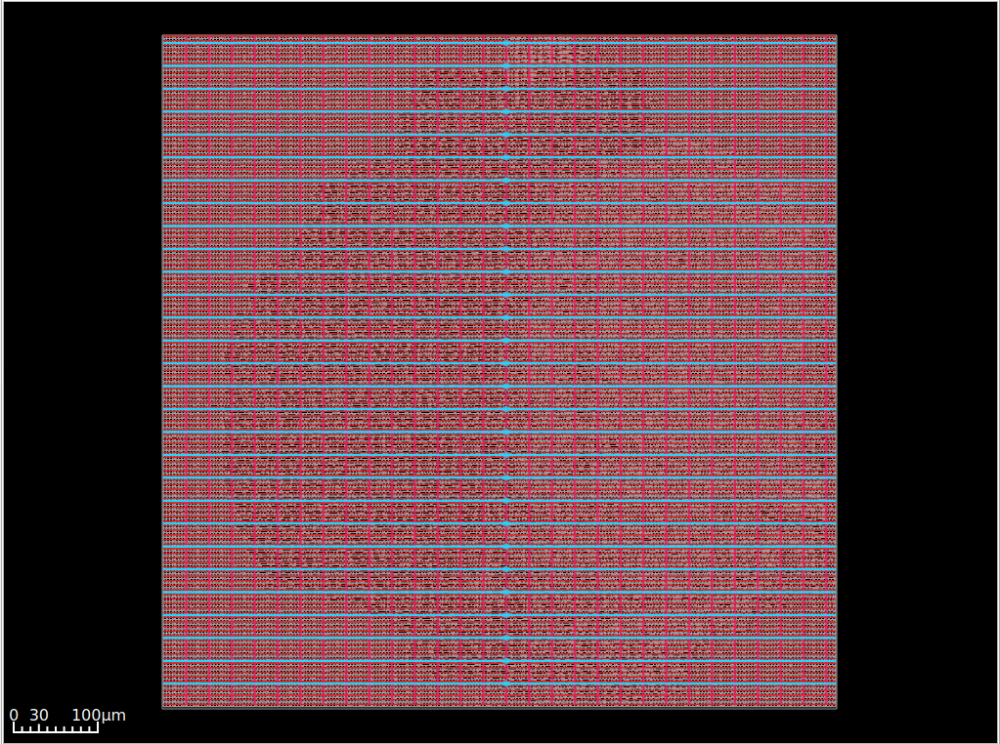
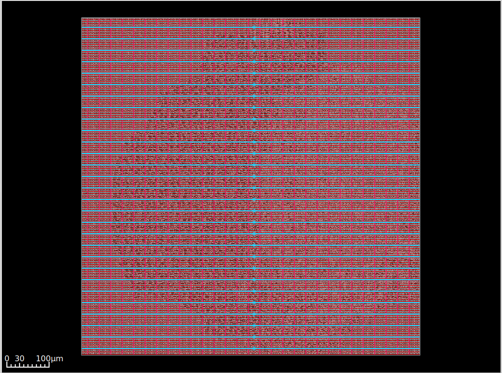
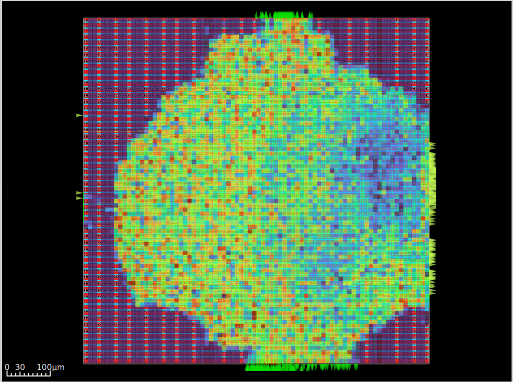
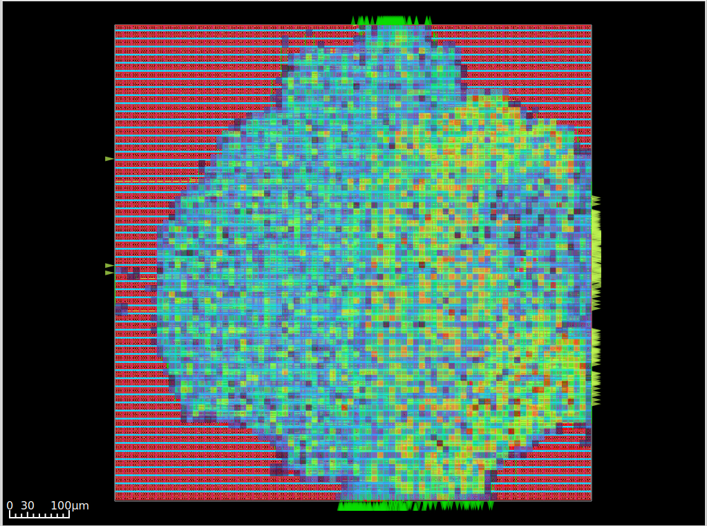
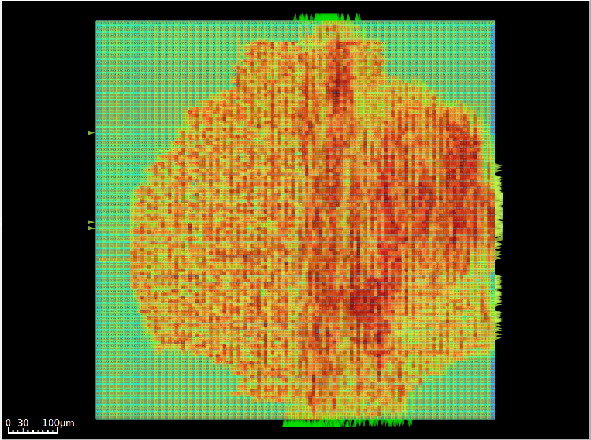
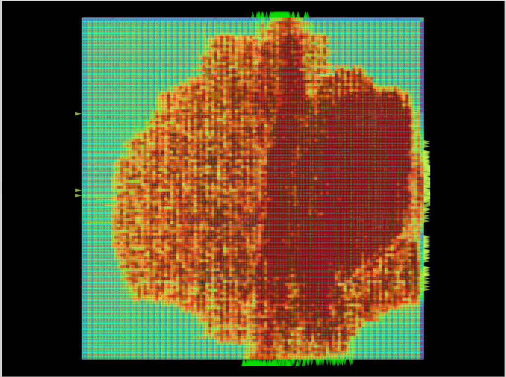
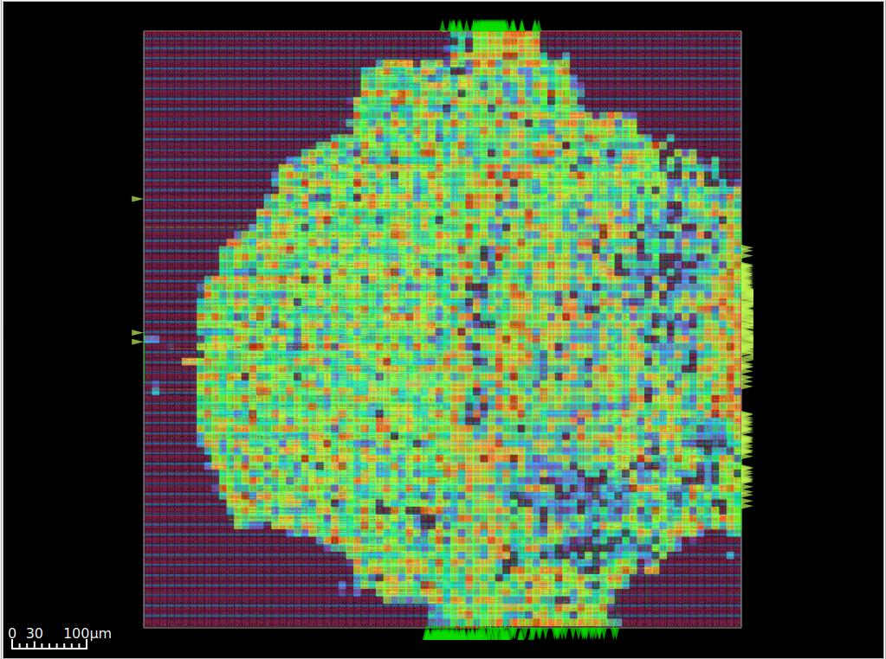
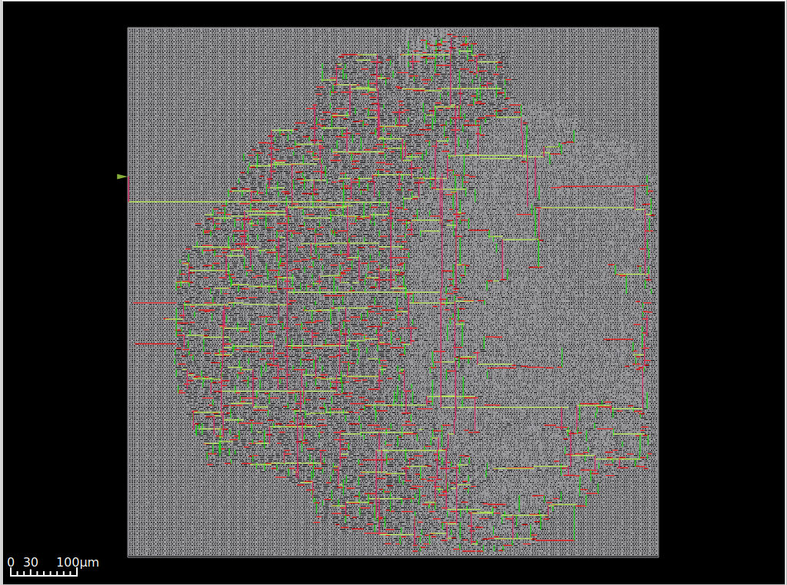

# Krea RV64I Processor – Quantitative Physical Design Report

## 1. Introduction

This repository presents the complete RTL-to-GDSII implementation of a 64-bit RISC-V (RV64I) processor using the SKY130 130 nm standard-cell technology. The design is implemented using an OpenLane/OpenROAD-based flow, with detailed logs and reports generated at each stage.

This document provides a **quantitative and visual analysis** of the design, combining numerical metrics from reports with graphical insights from generated layout and heatmap visualizations.

---

## 2. Final Physical Layout

**Figure 1: Final GDSII Layout of the RV64I Core**  
This layout represents the fully placed and routed design after signoff. Standard cells are uniformly distributed, and routing spans multiple metal layers. The absence of discontinuities aligns with 100% routing completion and zero DRC violations, confirming manufacturability.

---

## 3. Design Context and Timing Targets

The design targets a clock period of approximately 10 ns. Final signoff results indicate:

- Minimum clock period: 9.94 ns  
- Maximum operating frequency: 100.62 MHz  

This demonstrates that the implementation slightly exceeds its intended timing target while maintaining stability.

---

## 4. Floorplanning and Power Distribution

**Figure 2: Power Distribution Network (VDD Grid)**  
The VDD network shows a structured grid of horizontal and vertical straps ensuring uniform voltage delivery. The regular topology supports stable current distribution across the core.

**Figure 3: Ground Distribution Network (VSS Grid)**  
The ground network complements the power grid, providing low-resistance return paths. Reports confirm zero IR drop violations, indicating electrical stability.

---

## 5. Placement Analysis

**Figure 4: Placement Density Heatmap**  
The heatmap highlights spatial distribution of standard cells. High-density regions correspond to datapath logic, while control logic remains more sparse. Placement is legal with no overflow, and density remains within acceptable bounds.

---

## 6. Pin Distribution

**Figure 5: Pin Density Heatmap**  
This visualization shows clustering of I/O and internal connection points. Concentrated pin regions reduce routing distance for critical paths, improving routing efficiency.

---

## 7. Routing and Congestion Analysis

**Figure 6: Post-Routing Congestion Heatmap**  
This map shows final congestion after detailed routing. High-density routing regions are resolved without violations, confirming successful congestion handling.

**Figure 7: Pre-Routing Congestion Estimation**  
The estimated congestion map predicts routing pressure before detailed routing. Comparison with Figure 6 demonstrates effective congestion mitigation.

---

## 8. Power Analysis

**Figure 8: Power Density Heatmap**  
Regions of higher power density align with compute-intensive blocks. No extreme hotspots are observed, indicating balanced power distribution and thermal stability.

---

## 9. Clock Tree Analysis

**Figure 9: Clock Distribution Network**  
The clock tree structure shows buffered branching across the design. The uniform distribution supports controlled skew and synchronized operation.

Quantitative metrics:
- Clock skew: 0.37 ns  
- Clock uncertainty: 0.20 ns  

---

## 10. Placement and Timing Correlation

Placement optimization and clock tree synthesis together contribute to final timing closure. The resizer stage introduces buffering and gate sizing to reduce path delays prior to routing.

Final timing results:

- Worst Negative Slack (WNS): 0.00 ns  
- Total Negative Slack (TNS): 0.00 ns  
- Worst slack: +0.06 ns  

All timing paths meet constraints, with a positive margin of approximately 0.6% of the clock period.

---

## 11. Routing Completion and Physical Verification

Routing completes with full connectivity across all nets. Detailed routing resolves all violations identified during global routing.

Key outcomes:

- Routing completion: 100%  
- DRC violations: 0  
- Antenna violations: resolved  

The clean routing is visually supported by the absence of discontinuities in congestion and layout views.

---

## 12. Final Design Summary

| Metric                     | Value        |
|--------------------------|-------------|
| Technology Node          | 130 nm      |
| Clock Period             | 9.94 ns     |
| Maximum Frequency        | 100.62 MHz  |
| Worst Negative Slack     | 0.00 ns     |
| Total Negative Slack     | 0.00 ns     |
| Worst Slack              | +0.06 ns    |
| Clock Skew               | 0.37 ns     |
| Clock Uncertainty        | 0.20 ns     |
| Routing Completion       | 100%        |
| DRC Violations           | 0           |
| IR Drop Violations       | 0           |

---

## 13. Conclusion

The design successfully completes the full physical design flow, achieving timing closure, clean routing, and stable power delivery. Quantitative metrics and visual evidence confirm that the implementation is both functionally correct and physically manufacturable.

The achieved performance of approximately 100 MHz is consistent with expectations for the SKY130 technology node.

---

## 14. Repository Structure

- `logs/` contains detailed execution logs for each stage  
- `reports/` includes quantitative analysis outputs  
- `results/` stores final design artifacts such as GDS, DEF, and SPEF  
- Visualization files provide graphical insights into placement, routing, congestion, and power distribution  

---

This document serves as a complete, traceable, and quantitative reference for the RV64I processor physical design implementation.