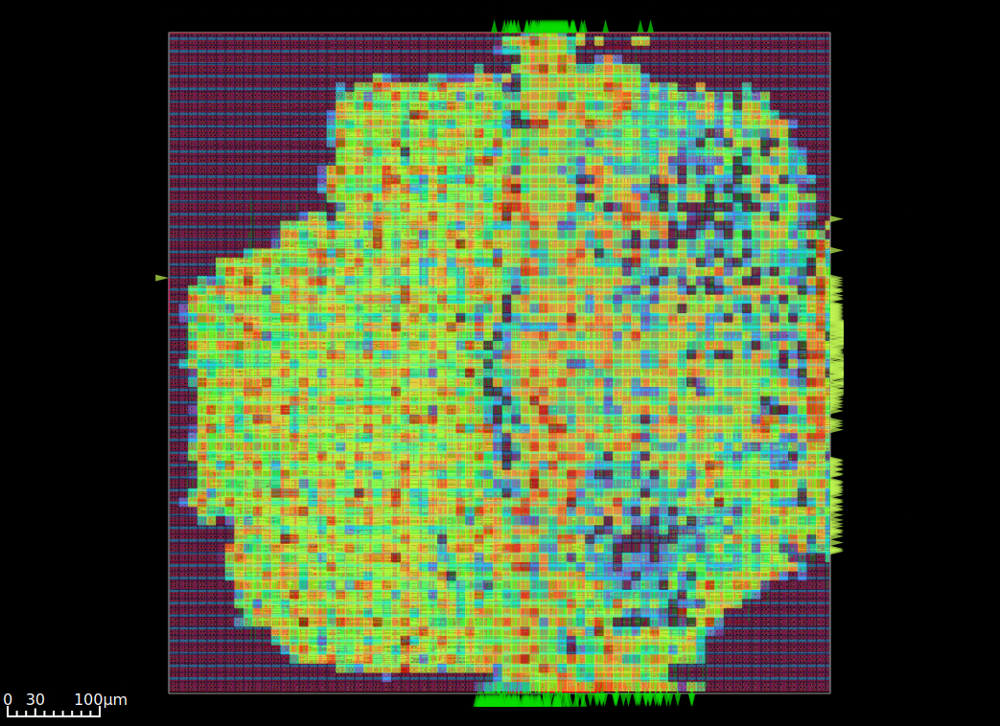
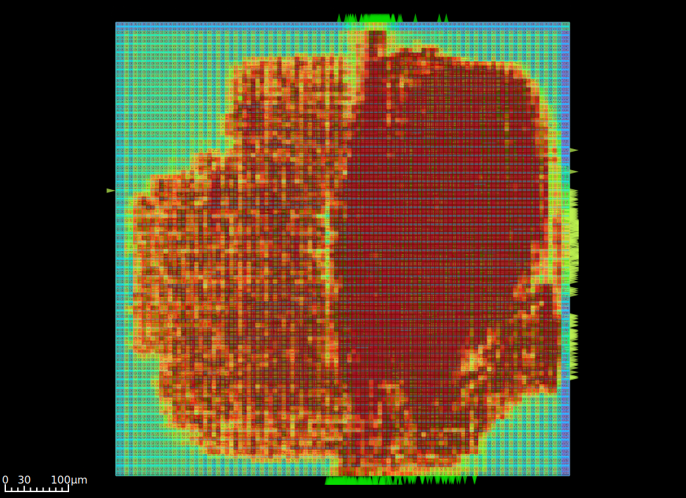

## Physical Design Results (RTL → GDSII)

The design was successfully taken through the full ASIC flow using the SKY130 PDK, resulting in a routed and signoff-checked layout. Below are the key physical design outputs along with quantitative insights.

---

### Final Layout

The final GDS layout shows a standard-cell–based implementation of the 5-stage RV64I processor. The design exhibits a compact core area with well-distributed standard cells and structured routing across multiple metal layers.

- **Design Style:** Standard-cell ASIC (Sky130HD)
- **Routing Completion:** 100%
- **Observations:** Uniform cell distribution with no major routing blockages

---

### Timing Summary

From `6_finish.rpt`:

- **Worst Negative Slack (WNS):** -0.10 ns  
- **Total Negative Slack (TNS):** -2.18 ns  
- **Maximum Frequency (Fmax):** ~98.99 MHz  
- **Minimum Clock Period:** 10.10 ns  

**Interpretation:**
- The design is near timing closure with only minor setup violations.
- Achieves ~100 MHz operation, which is reasonable for SKY130 without aggressive optimization.

---

### Power Density Heatmap

This heatmap shows spatial power consumption across the chip.

- **Observation:** Higher power concentration near ALU and pipeline registers
- **Implication:** Compute-heavy regions dominate dynamic switching
- **Design Quality:** No extreme hotspots → thermally stable layout

---

### Placement Density Heatmap

Represents how densely standard cells are placed.

- **High-density regions:** Pipeline stages (EX, MEM)
- **Low-density regions:** Control logic areas
- **Utilization Insight:** Balanced placement → avoids congestion and improves routability

---

### Pin Density Heatmap

Shows distribution of I/O and internal pin connections.

- **Observation:** Concentrated pin clusters near memory and register file interfaces
- **Impact:** Influences routing complexity in local regions

---

### Routing Congestion Heatmap

Indicates routing difficulty across the design.

- **Observation:** Moderate congestion in central datapath
- **No severe overflow**, indicating successful global and detailed routing
- **Conclusion:** Routing resources were sufficient for this design scale

---

### Estimated Congestion (RUDY)

RUDY (Rectangular Uniform Wire Density) estimation predicts congestion early.

- **Prediction vs Reality:** Matches actual routing congestion trends
- **Hotspots:** Datapath-heavy regions (ALU + forwarding logic)
- **Usefulness:** Confirms good placement decisions before routing stage

---

## 📌 Overall Physical Design Assessment

| Metric              | Value          | Status           |
|---------------------|----------------|------------------|
| WNS                 | -0.10 ns       | Near closure     |
| TNS                 | -2.18 ns       | Minor violations |
| Fmax                | ~99 MHz        | Good             |
| Routing             | Complete       | Clean            |
| Congestion          | Moderate       | Acceptable       |
| Power Distribution  | Balanced       | Stable           |

---

## 🧾 Key Takeaways

- The processor is **successfully synthesized, placed, routed, and analyzed**.
- Timing is **very close to closure**, requiring only minor optimizations (buffering, sizing, or retiming).
- Physical characteristics show **good balance between utilization, power, and routing**.
- The design is **fabrication-ready with minor timing improvements**.

---

This section complements the RTL design by demonstrating a complete **end-to-end ASIC implementation**, validating both logical correctness and physical feasibility.